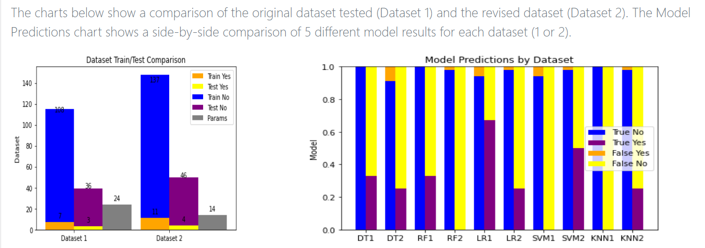
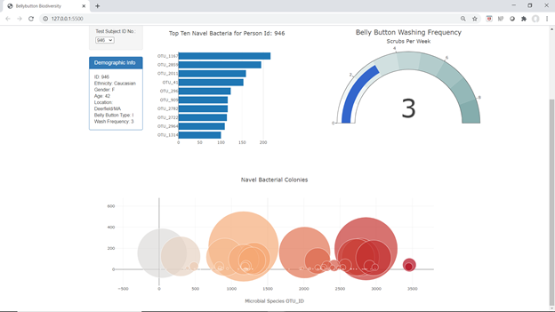
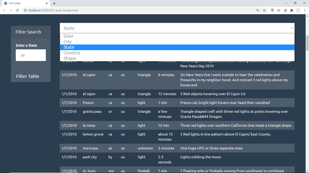

# My Projects

### Health Predictions

[HealthPredictions](https://carleeyoung.github.io/Health-Prediction/templates/index.html)

The Health Predictions project analyzes datasets for Coronary Artery Disease and Kidney failure to make predictions about survival and diagnosis.  This was a collaborative effort between myself and teammates Dylan Obermueller, Trevor Guleserian, and Jerod Rhodes.  My contributions to the project were to the kidney dataset analysis used to predict incidents of Coronary Artery Disease in Kidney Failure patients.  The kidney dataset did not provide adequate data for accurately predicting Coronary Artery Disease.  Missing rows of data reduced the number of positive cases of Coronary Artery Disease to 15, giving limited information for the models to reliably predict outcomes.  Though Coronary Artery Disease and Kidney Disease may go hand-in-hand, the data used to predict one disease is not necessarily indicative of the other.

### Biodiversity-challenge

[BiodiversityWebsite](https://carleeyoung.github.io/biodiversity-challenge/)

In this challenge, results from a belly button microbial characterization study were charted using Plot.ly, JavaScript, and html code to visualize data for each indivual in the study. The first visualization is a horizontal bar chart displaying the species identified by the operational taxonomic units (OTU_ID), and the number of colony forming units found of each species. The guage chart displays the belly button scrubbing frequency reported by the indivual. The bubble chart represents the magnitude of growth for each microbial species reflected by the size of each bubble.

### UFO Sightings

[UFO Sightings Webpage](https://carleeyoung.github.io/javascript-challenge/UFO-level-1/)

Working with UFO Sighting data, html and javaScript, a webpage was created to view a filterable table of UFO sightings.

