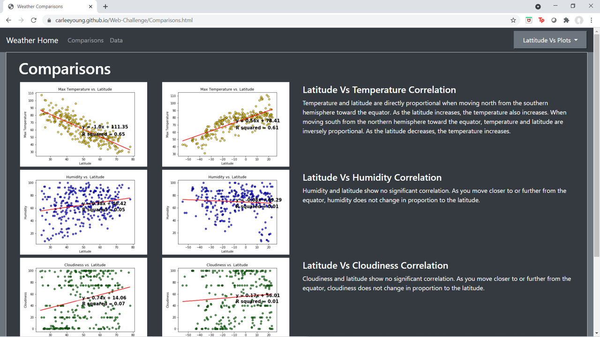

[Click here to visit my website.](https://carleeyoung.github.io/)

# My Projects

### Health Predictions

[HealthPredictions](https://carleeyoung.github.io/Health-Prediction/templates/index.html)

The Health Predictions project analyzes datasets for Coronary Artery Disease and Kidney failure to make predictions about survival and diagnosis.  This was a collaborative effort between myself and teammates Dylan Obermueller, Trevor Guleserian, and Jerod Rhodes.  My contributions to the project were to the kidney dataset analysis used to predict incidents of Coronary Artery Disease in Kidney Failure patients.  The kidney dataset did not provide adequate data for accurately predicting Coronary Artery Disease.  Missing rows of data reduced the number of positive cases of Coronary Artery Disease to 15, giving limited information for the models to reliably predict outcomes.  Though Coronary Artery Disease and Kidney Disease may go hand-in-hand, the data used to predict one disease is not necessarily indicative of the other.

### Covid vs Crime Correlation in Kansas City, Missouri

[CovidVsCrime](https://carleeyoung-kc-covid-vs-crime.herokuapp.com/)

The Covid Vs Crime Correlation dashboard shares data provided by OPENDATA KC and the Census Bureau. The data extracted from these sources was transformed and loaded into three relational SQLite databases using Python, Pandas, Jupyter Notebooks, and SQL Alchemy.  Interactive visualizations of these databases were created using a Python Flask App in conjunction with HTML, CSS, JavaScript, Leaflet, Plotly, and Plotly React.  Each visualization features interactive information showing stats on COVID-19 cases and crime broken down by zipcode.  

### Biodiversity-challenge

[BiodiversityWebsite](https://carleeyoung.github.io/biodiversity-challenge/)

In this challenge, results from a belly button microbial characterization study were charted using Plot.ly, JavaScript, and html code to visualize data for each indivual in the study. The first visualization is a horizontal bar chart displaying the species identified by the operational taxonomic units (OTU_ID), and the number of colony forming units found of each species. The guage chart displays the belly button scrubbing frequency reported by the indivual. The bubble chart represents the magnitude of growth for each microbial species reflected by the size of each bubble.

### Census Demographics

[Census Demographics Webpage](https://carleeyoung.github.io/D3-challenge/D3_data_journalism/)

2016 Census demographics were charted to show relationships between median household income, age, and poverty with healthcare, smoking and obesity for each state.  D3 coding was used to
create a dynamic chart to compare select parameters.  A tooltip was added to show detailed
information on each datapoint as you hover over the point.

### Citi Bike Visualizations in Tableau

[Citi Bike Ridership on Tableau Public](https://public.tableau.com/profile/carlee1533#!/vizhome/CitiBike_Analysis_15998401097300/Story1?publish=yes)

Citi Bike data was downloaded from their website (https://www.citibikenyc.com/system-data) for ridership in 2019 through the end of August 2020 and uploaded into Tableau to create data visualizations.  The visualizations were used to create a storyboard including dashboards of the data visualizations.  Overall, the data reflects the drop in ridership at the beginning of 2020 due to quarantine with the COVID-19 pandemic.  Ridership did pick up by the end of the second quarter but was still below normal levels as compared to the 2019 ridership data.  Ridership is most popular in the eastern region of the Jersey City area, while the western Jersey City and New York City locations were less popular.  Subscriptions were most popular with the thirty-something crowd.  Looking at a breakdown of ridership by gender, the "other" category is growing in 2020 over the 2019 numbers while male ridership continues to represent the majority.

### Visuallizing Data with Leaflet
[US Earthquake Map](https://carleeyoung.github.io/Leaflet-Challenge/leaflet-Step-1/)

[World Earthquake Map](https://carleeyoung.github.io/Leaflet-Challenge/leaflet-Step-2/)

Two maps were created using data from the USGS for earthquake magnitude and location over the past seven days.
The first map shows the earthquakes in the North American region with circle markers showing the location and 
magnitude of each earthquake.  The larger the circle and darker the shade, the high magnitude or stronger the 
earthquake.  This map also shows detailed information when you click on an individual earthqauke marker.  There
is a legend with a key for magnitude and color.  Additionally, the map has the capability of switching from the
default street map style view to a dark map view using the control box in the upper right corner.  This control
box also allows you to toggle the earthquake markers on and off.

The second map shows a global image of earthquakes in the past 7 days and techtonic plate boundaries.  Circle
markers change in size and color depending on the magnitude of the earthquake.  The weakest earthquakes are 
shown in small light orange and the strongest in large dark red circles.  Information about each earthquake is
provided when the circle marker is clicked on.  The map options are satellite or street view and these can be
toggled on or off using the control key in the upper right hand corner.  Earthquake markers and techtonic plate
boundaries can also be toggled on and off using the same control key.  The legend shows magnitude and color
correlation for each earthquake.  

### Weather vs Latitude Analysis with API calls and Python

[Weather Latitude Website](https://carleeyoung.github.io/Web-Design-Challenge/index.html)

Weather data was collected from more than 500 cities generated from randomly selected latitude and longitude coordinates.  Relationships between latitude and temperature, humidity, cloudiness, and wind speed were analyzed. From these results, the list was restricted by pre-determined "ideal" weather conitions.  From the reduced data set of cities with ideal weather conditions, the nearest hotels were found and mapped.

Weather Analysis and Observations:

* With a moderate correlation between temperature and latitude, you are generally more likely to experience warmer temperatures near the equator.
* Humidity, cloudiness, and wind speeds have no relationship to latitude with r-squared values at or very near zero.
* Southern hemisphere temperatures are directly proportional to latitude and norhtern hemisphere temperatures are inversely proportional to latitude. As latitude increases, temperature increases if you are in the southern hemisphere. As latitude decreases, temperature increases if you are in the northern hemisphere.
* Peak temperatures occur at 20 degrees north of the equator. Looking at seasonal data would be interesting to investgate the impact of the tilting of the Earth on its axis with respect to the latitude of peak temperatures in different seasons.

  

### UFO Sightings

[UFO Sightings Webpage](https://carleeyoung.github.io/javascript-challenge/UFO-level-1/)

Working with UFO Sighting data, html and javaScript, a webpage was created to view a filterable table of UFO sightings.

